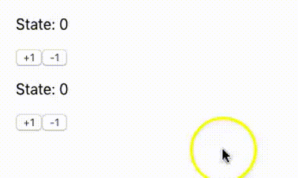

# react-create-global-state

Generate a useState, but for global variables.


## Usage

1 - Create your custom hook

```jsx
/**
 * useGlobalCounter.js
*/

import createGlobalState from 'react-create-global-state'

// create the global for your hook
const initialState = 0

const [useGlobalCounter, Provider] = createGlobalState(initialState)

// export the provider to link in the application
export const GlobalCounterProvider = Provider

// export the hook
export default useGlobalCounter
```

2 - Link the provider in your application

```jsx
import React, { Component } from 'react';

// import the provider from your global var
import { GlobalCounterProvider } from './useGlobalCounter'

class App extends Component {
  render() {
    return (
      // add the provider.
      <GlobalCounterProvider>
        <div>
          {/*...*/}
        </div>
      </GlobalCounterProvider>
    );
  }
}

export default App

```

3 - Use the hook

```jsx
/**
 * Counter.js
*/
import React from 'react'
import useGlobalCounter from './useGlobalCounter'

export default function Counter(props) {
  const [state, setState] = useGlobalCounter()

  return (
    <div>
      <p>State: {state}</p>
      <button onClick={() => setState(state + 1)}>+1</button>
      <button onClick={() => setState(state - 1)}>-1</button>
    </div>
  )
}
```

```jsx
/**
 * App.js
*/
import React, { Component } from 'react';

import { GlobalCounterProvider } from './useGlobalCounter'

import Counter from './Counter'

class App extends Component {
  render() {
    return (
      <GlobalCounterProvider>
        <div style={{ margin: '20px' }}>
          <Counter />
          <Counter />
        </div>
      </GlobalCounterProvider>
    );
  }
}

export default App
```

Result:




## Sample

You can check the sample code [HERE](https://github.com/benhurott/react-create-global-state-sample)

